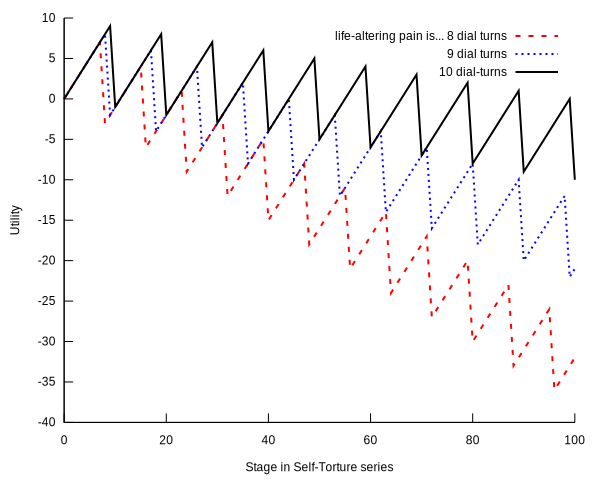

# The Puzzle of the Self-Torturer

## Plan

- I've been fascinated by self-torture for over a decade now.

- I will...

	1. Introduce the Puzzle;
	2. Describe my previous solution and why it failed;
	3. Present my new solution from @ElsonBookForthcoming.

## The Core of the Puzzle

- An agent (ST) can repeatedly choose negligible extra pain for a lot
  of money.
  
- Every time, taking the money looks preferable.

- Foreseeably, if he does this too many times he'll end up in agony.

- It looks like he should stop at some point... but not this point.

- The question: how to vindicate stopping?

## The Upshot

- Some think Self-Torture involves intransitive or cyclic preferences:
    - ST prefers each stage to the previous one;
    - ST prefers earlier stages to later.

- @Andreou2023 argues that intransitive preferences are
  *rational* here.
  
- I disagree. I've tried to argue that there is no intransitivity but
  only vagueness.

## Vague Projects

- Many 'vague projects' or 'practical sorites' have this kind of
  structure.
  
- I prefer to stay in bed one more minute, not the whole day.

- @Aldred2007 claims that vagueness itself engenders intransitive preferences.

- @Tuck2008 considers my favourite example: a shepherd wants to build cairns but
not move heavy stones.

- But I don't think anyone has given a convincing picture of how they work.

## The Sustainability Relevance

- Aldred uses the example of an unspoilt common, for example.

- Many of us like flights or air-conditioning or
  steak but also prefer not to wreck the atmosphere.

- "It makes negligible difference/it's just a drop in the ocean" is a
  common defence of carbon emissions. See @Lane2018 on 'negligibility' in this context.

- If Andreou is right, for example, then climate change involves
  *rational* cyclic preferences.
  

# My Previous Model of Self-Torture

## The Idea

- In @Elson2016a I argued that there's an optimum trade-off of pain
  and money.
  
- At some stage n with $10,000n, ST is most satisfied:
  - before that, his utility function increases;
  - it peaks at the optimum point;
  - then decreases afterwards.

- This picture of the situation fits naturally into orthodox
  (transitive!) rational choice theory.

- I argued that it's vague *at which* point ST's utility peaks.

## An old graph

## My picture of vagueness

- I'm assuming a *tolerance-denying* account of vagueness:
  - There are many 'sharpenings' of a vague predicate, ways it could
    be made precise.
  - In borderline cases, sharpenings disagree.

- *Tolerance* principles such as "if n grains of sand aren't a heap
   then (n+1) grains of sand aren't a heap" are false, because false
   on all sharpenings.

- This picture is clearly inspired by @Fine1975 and similar supervaluationism,
  but compatible with epistemicism.

## ST's utility function

- There are many sharpenings of ST's utility function, corresponding
  to ways of weighing money and pain.

- All have the same shape but peak at different stages. The following tolerance principle is false:

Torturer-Tolerance.
:    If stage $k$ doesn't maximise utility, then stage $(k+1)$ doesn't
     maximise utility.

- But tolerance principles are psychologically compelling.

- His preferences are indeterminate but transitive.

# Why This Won't Work

## The Problem with this Model

- This model has been rightly criticised, especially by
  [@Tenenbaum2020, pp. 94--100].

- Consider some stage determinately *after* the utility peak.

- The slope is now determinately downwards, so turning the dial is
  determinately and clearly dispreferred.

- But intuitively, part of the difficulty of self-torture is that
  *even when already in agony* it looks rational to take the money.

## Nonsegmentation

- Ideally, we want to respect the following principle:

Nonsegmentation.
:    When faced with a certain series of choices, the rational
    self-torturer must choose to stop turning the dial before the last
    setting; whereas in any isolated choice, she must (or at least
    may) choose to turn the dial. [@TenenbaumRaffman2012, p. 98]

# A Repeating Model

## The Core Idea

- Instead of a single utility peak whose location is vague,
- the curve is indeterminately rising or falling at each point,
- but determinately falls over longer ranges.

- This explains Nonsegmentation:
    - Taking the money is indeterminately preferred at each point, but *determinately not* at longer ranges.
  

## Life-Altering Pain Increases

- A stipulative use: a *life-altering* pain increase is
  substantial, determinately not worth it for $100,000.

- Here's the vagueness: it's indeterminate whether a
  life-altering pain increase happens after 8, 9, or 10 dial turns.

* At stage $n$, you've undergone $\lfloor n/s \rfloor$ life-altering
  pain increases:
    - the number of dial-turns $n$ divided by how many $s$ make such
      an increase;
    - $s$ is indeterminately 8, 9, or 10.

## Putting numbers on pain

* Utility from money is linear in ten thousand dollars:
    * $u_{m}(n)=n$

* Since a life-altering pain increase outweighs $100,000, let's assume
  it's worth -11 utils:
    * $u_{p}(n)=-11\lfloor n/s \rfloor$

## The Upshot

- In the graph to follow, each line represents a sharpening of
  'life-altering pain', thus of ST's utility function.

- At many points, the lines have different slopes:
    - some are up, some are down;
    - it's indeterminate whether ST prefers to turn the dial.

- Over every stretch of 10 dial-turns or longer, they all decline. At
  every stage, he determinately disprefers the situation 10 dial-turns
  from now.

## Graph of the final model

## Features of the Repeating Model

- It is obviously simplified in many ways.

- But we can respect Nonsegmentation *without* having to go for
  intransitive preferences or anything of that sort.

- We simply needed vagueness in how many dial-turns form a life-altering 'clump' of pain that you care about.

- This doesn't fall to Tenenbaum's correct criticism of my earlier picture.

# Conclusion

## Summary

- Vagueness together with psychological features of tolerance
  principles (they are false but extremely plausible) explains the
  temptation to always turn the dial.

- Self-Torture is a 'repeating' practical sorites -- there's no
  threshold (even vague threshold) where once we are past it, the game
  is over.

- I've focused on preferences here, to show that they can have the right structure.

- Thank you!

## References
